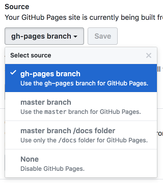
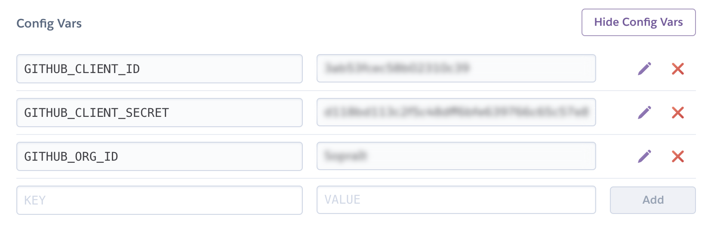
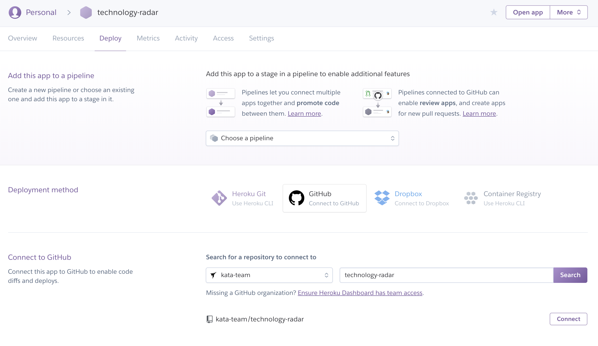
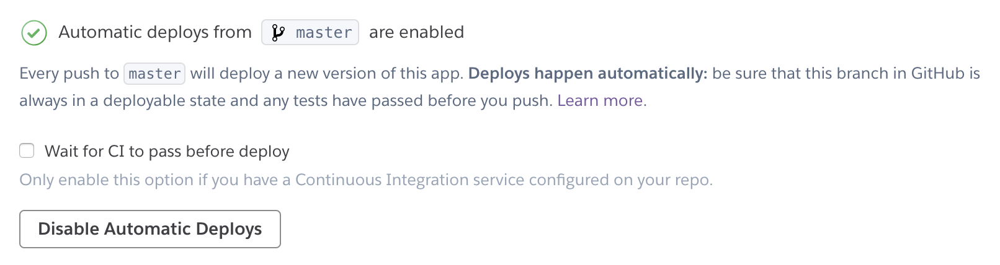
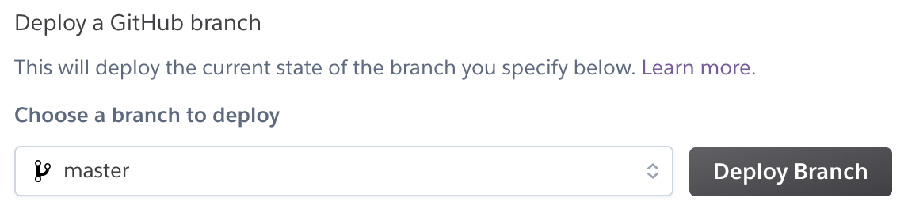

Technology Radar
================

[](https://kata-team.github.io)
[](https://travis-ci.org/kata-team/technology-radar)
[](https://www.codacy.com/app/kata-team/technology-radar?utm_source=github.com&amp;utm_medium=referral&amp;utm_content=kata-team/technology-radar&amp;utm_campaign=Badge_Grade)


Technology Radar is a tool that helps organizations to monitor their own discoveries.
Keep track of your technologies according to your previous successes and failures.

This project is freely based on technology-radar by [ThoughtWorks](https://www.thoughtworks.com/radar).

In short
--------

- ES6 and [React](https://facebook.github.io/react/)
- Hosted publicly by [GitHub Pages](https://pages.github.com/)
- Hosted privately by [Heroku](https://www.heroku.com/)
- Automatic deploy with `git push origin production`
- Google Spreadsheets as database


Live demo
---------

Here you can find our live demo so you can explore all features.

[https://kata-team.github.io/technology-radar](https://kata-team.github.io/technology-radar)


To-Do List
----------

- [x] Responsive Web Design
- [x] Search items
    - [x] search by `title` and `description`
    - [x] filter by `category`
    - [x] filter by `status`
    - [x] filter by `tags`
- [x] [Google Spreadsheets integration](#google-spreadsheets-integration)
- [x] [Live demo with GitHub Pages](#github-pages)
- [x] [Continuous Delivery with Travis CI](#travis-ci)
- [x] [Deploy your private site with Heroku](#heroku---bonus-track)


Getting Started
---------------

To get started, fork the project and clone your new repository.

[](https://github.com/kata-team/technology-radar/fork)

```sh
cd technology-radar/

cp .env.example .env

npm install
npm start

# http://localhost:3000/
```


#### Available tasks

* `npm test`          A linter tool for identifying and reporting on patterns in JavaScript.
* `npm start`         Run HTTP Server on http://localhost:3000/ and watch for changes.
* `npm run build`     Compile "javascripts" and "stylesheets".
* `npm run deploy`    Alias for "build". After that, will push changes of the **build** folder to **master** branch.


Google Spreadsheets integration
-------------------------------

Technology Radar provides a Google Spreadsheets integration, so you can use spreadsheets to storage your data.

Here you can find the example used for our [live demo](#live-demo). Feel free to duplicate the document and make your own.

[https://docs.google.com/spreadsheets/d/112MlfyXSlIQ8nae85Te_xWDBP136GRaYeHlDdKgYyPo](https://docs.google.com/spreadsheets/d/112MlfyXSlIQ8nae85Te_xWDBP136GRaYeHlDdKgYyPo)

#### Create your own

1. Open the document using the provided link.
1. Click on `File → Make a copy...` and choose a filename.
1. Modify the document adding or removing items.
1. Select `File → Publish to the web...` and click on `Publish`.
1. Now you just need to copy the `worksheetId` from the url (e.g. `112MlfyXSlIQ8nae85Te_xWDBP136GRaYeHlDdKgYyPo`)
1. Open the file `.env` and paste to `REACT_APP_SPREADSHEET_ID`.
1. Save the file e compile the project with `npm run build`.


GitHub Pages
------------

The project is a set of html, css and javascript so it can be executed using [GitHub Pages](https://pages.github.com/).

We use GitHub Pages to provide you our live demo.

> You can configure GitHub Pages to publish your site's source files from `master`, `gh-pages`, or a `/docs` folder on your `master` branch for Project Pages and other Pages sites that meet certain criteria.

> If your site is a User or Organization Page that has a repository named `<username>.github.io` or `<orgname>.github.io` , you cannot publish your site's source files from different locations. User and Organization Pages that have this type of repository name are only published from the `master` branch.

> https://help.github.com/articles/configuring-a-publishing-source-for-github-pages/

For this project we preferred to use `master` branch to publish our site instead of `gh-pages` branch:

1. As written in GitHub documentation, if you use `<username>.github.io` or `<orgname>.github.io`, the site is only published from the `master` branch.

1. If you have a `gh-pages` branch inside your repository, you cannot switch off the GitHub Pages functionality.

    

1. If you have a private repository and want to publish a private site, you cannot use `gh-pages` branch (read point before).


#### Setup GitHub Pages

##### on Code

1. Open the configuration file at `package.json`.
1. Change `repository.url` link with your repository link.
1. After that you can deploy to `master` with `npm run deploy`.
1. You can also deploy to `master` using [TravisCI](#travis-ci).

##### on GitHub

1. Go to your repository page and click on `settings`.
1. Scroll down to the `GitHub Pages` section.
1. Set the `source` to `master` branch and click on Save.
1. That's it! Now your site is published.


Travis CI
---------

We use [Travis CI](https://travis-ci.org/kata-team/technology-radar) for Continuous Delivery.

- When you push your code to remote, Travis will automatically test you code and warn you if something goes wrong.
- If you push to `production` branch, Travis will compile and push your code to `master` branch (if all tests pass).

#### Setup Travis CI

##### Obtaining a Github token

1. Log into Github and go to user `Settings` page.
1. Click on `Personal access tokens`.
1. Click on `Generate new token`.
1. Add a `Token description` (e.g. `TravisCI`).
1. Select `public_repo` under `scope` section.
1. Click on `Generate token` button.
1. Copy the provided token (**after a page refresh you will never be able to get that token again**)

##### Add token and worksheetId to TravisCI

1. Log into TravisCI and go to repository `Settings` page.
1. Add new `Environment Variables`.
   * Name: `GH_TOKEN`
   * Value: *paste here the token value*
1. Click on `Add` button.
1. Add new `Environment Variables`.
   * Name: `REACT_APP_SPREADSHEET_ID`
   * Value: *paste here the `worksheetId` value*
1. Click on `Add` button.


Heroku - bonus track
--------------------

Even if the repository is private, the published site with **GitHub Pages is always public**.


### Step 1 - Add `Jekyll Auth` to your site

> this caption is just a memo; we did this already for this project.

> [Jekyll Auth](https://github.com/benbalter/jekyll-auth) is a simple way to use GitHub OAuth to serve a protected Jekyll site to your GitHub organization.

1. Create a file called `Gemfile` inside the `public` folder with the following content:

    ```rb
    source "https://rubygems.org"

    gem 'jekyll-auth'
    ```

2. `cd` into your `public` directory and run `bundle install`.

3. Run `bundle exec jekyll-auth new` which will copy the necessary files to set up the server.


### Step 2 - Create a GitHub Application

1. Navigate to the [GitHub app registration page](https://github.com/settings/applications/new).
1. Give your app a name.
1. Tell GitHub the URL you want the app to eventually live at. If using a free Heroku account, this will be something like: https://technology-radar.herokuapp.com
1. Specify the callback URL; should be like this: https://technology-radar.herokuapp.com/auth/github/callback; note that this is https, not http.


### Step 3 - Setting up hosting with Heroku

1. Login to [Heroku](https://dashboard.heroku.com/apps).
1. Click on `create new app` from dashboard.
    * Select an `App name` ( e.g. technology-radar ).
    * Select a `Region`.
1. Click on `Settings` tab.
    * Add new buildpack, selecting `heroku/ruby`.
    * Click on `Reveal Config Vars`.
        
1. Click on `Deploy` tab and configure Heroku with your GitHub repository. Choose an organization, select a repository and click on `Connect`.




### That's it!

Just run `npm run deploy` from you local.

This task will build the project and will push the generated site to the `master` branch.

Now you can go back to your Heroku App and configure it to `enable automatic deploys from GitHub` from `Deploy` tab.



or just run a deploy :smile:


